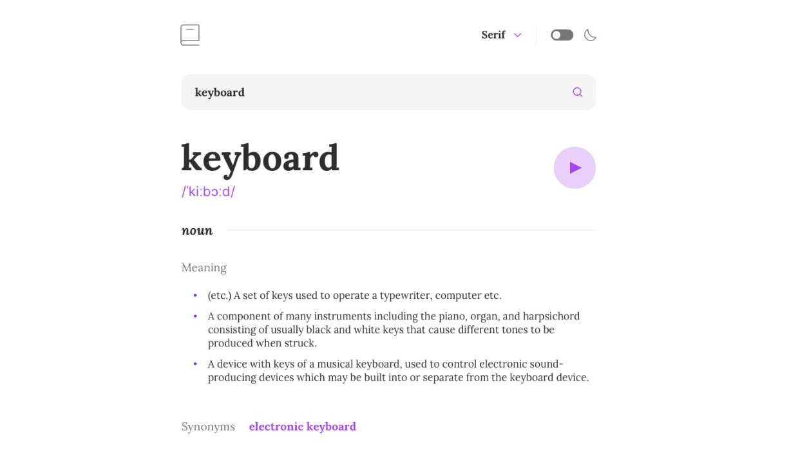

<h1 align="center">
  Notes.me
</h1>

<p align="center">
  
  
  
  
  

  <a href="https://github.com/humbruno/dictionary/commits/master">
    
  </a>
  
  <a href="https://github.com/humbruno/dictionary/issues">
    
  </a>
</p>

<p align="center">
  
</p>

## 💻 Project

Web dictionary app where you can search for a word to view its' definitions, as well as learn the correct pronounciation with the help of an audio file.

Technologies used for this project:

- [Vitejs](https://vitejs.dev/)
- [TypeScript](https://redux-toolkit.js.org/)
- [Dictionary API](https://dictionaryapi.dev/)

## 🔌 Live Website Link

- [Live Website](https://dictionary.brunosantos.dev/)

## 📥 Installing and executing

Clone this repository and access the directory.

```bash
# Instaling dependencies
$ npm install

# Executing the application
$ npm run dev
```
